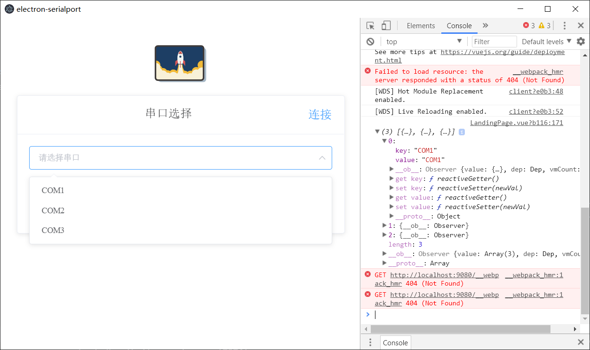
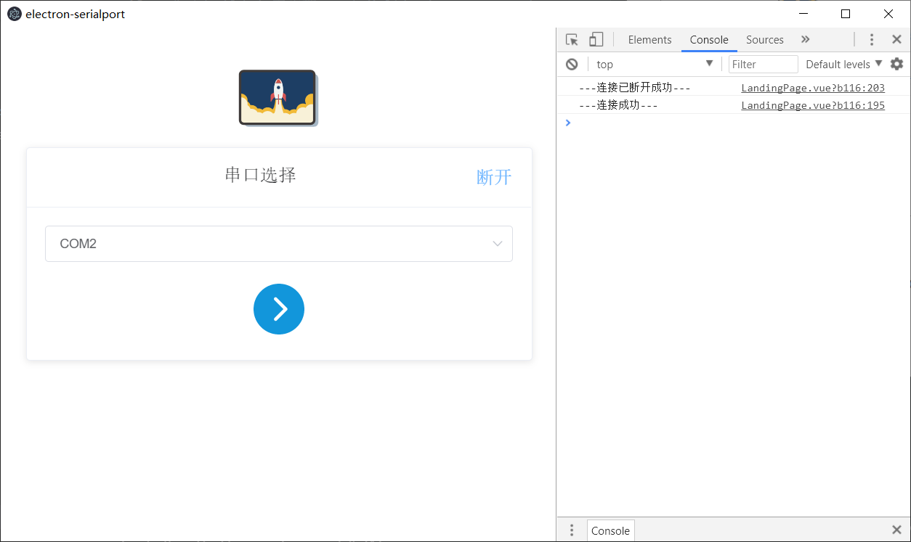

# electron-serialport

> electron-vue串口实例

#### 构建步骤

``` bash
# install dependencies
npm install

# serve with hot reload at localhost:9080
npm run dev

# build electron application for production
npm run build
# 如果build报错task已存在，那么修改.electron-vue里面的build.js，const tasks = new Listr 改为
# const tasks2 = new Listr 同时将 await tasks 改为await tasks2，如果仍然报错，那么将npm -i multispinner同时
# 在build.js中添加const Multispinner = require('multispinner')即可


```

---

#### 运行示例
可以直接下载打包好的程序[electron-serialport]()
##### 1. 列出串口设备


##### 2. 连接串口


#### 说明
本工程使用vue-electron构建，默认已经搭载element-ui以及vue-i18n国际化

---

#### License
```
MIT License

Copyright (c) 2021 kylin

Permission is hereby granted, free of charge, to any person obtaining a copy
of this software and associated documentation files (the "Software"), to deal
in the Software without restriction, including without limitation the rights
to use, copy, modify, merge, publish, distribute, sublicense, and/or sell
copies of the Software, and to permit persons to whom the Software is
furnished to do so, subject to the following conditions:

The above copyright notice and this permission notice shall be included in all
copies or substantial portions of the Software.

THE SOFTWARE IS PROVIDED "AS IS", WITHOUT WARRANTY OF ANY KIND, EXPRESS OR
IMPLIED, INCLUDING BUT NOT LIMITED TO THE WARRANTIES OF MERCHANTABILITY,
FITNESS FOR A PARTICULAR PURPOSE AND NONINFRINGEMENT. IN NO EVENT SHALL THE
AUTHORS OR COPYRIGHT HOLDERS BE LIABLE FOR ANY CLAIM, DAMAGES OR OTHER
LIABILITY, WHETHER IN AN ACTION OF CONTRACT, TORT OR OTHERWISE, ARISING FROM,
OUT OF OR IN CONNECTION WITH THE SOFTWARE OR THE USE OR OTHER DEALINGS IN THE
SOFTWARE.
```

---
This project was generated with [electron-vue](https://github.com/SimulatedGREG/electron-vue)@[8d4ed60](https://github.com/SimulatedGREG/electron-vue/tree/8d4ed607d65300381a8f47d97923eb07832b1a9a) using [vue-cli](https://github.com/vuejs/vue-cli). Documentation about the original structure can be found [here](https://simulatedgreg.gitbooks.io/electron-vue/content/index.html).
